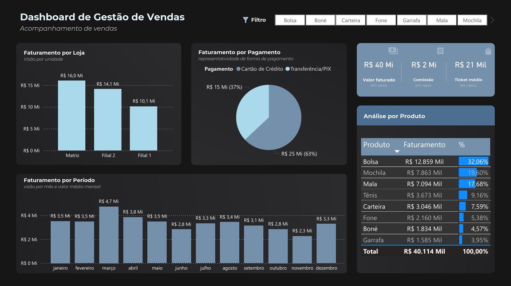

# 📊 Dashboard Interativo – Visualização de Dados

Este projeto demonstra o uso criativo de **fórmulas e visualizações personalizadas** para apresentar dados de forma clara e interativa. Ele oferece **filtros dinâmicos**, **seleção de gráficos** e **informações predefinidas** que tornam a exploração dos dados intuitiva e eficiente.

---

## 🔍 Funcionalidades

- Gráficos interativos e personalizáveis  
- Filtros dinâmicos para segmentação dos dados  
- Layout limpo e focado na usabilidade  
- Dados fictícios para fins de demonstração  

---

## 📸 Visualização do Projeto

---

## 📁 Arquivos

Os seguintes arquivos estão disponíveis na raiz do projeto:

- `dashboard.pbit` – Modelo interativo do Power BI  
- `dashboard.pdf` – Versão em PDF da apresentação dos dados  

---

## 🌐 Publicação

> ⚠️ **Nota**: Ainda não foi possível publicar o projeto online devido a restrições do e-mail corporativo. O site vem apresentando instabilidades.

---

## 👤 Autor

Desenvolvido por **Vyttor Mendes**.  
Fique à vontade para explorar os arquivos e adaptar o projeto às suas necessidades.

---
